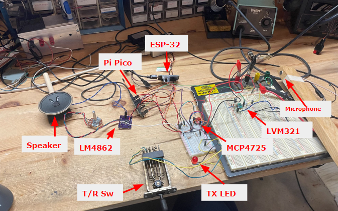
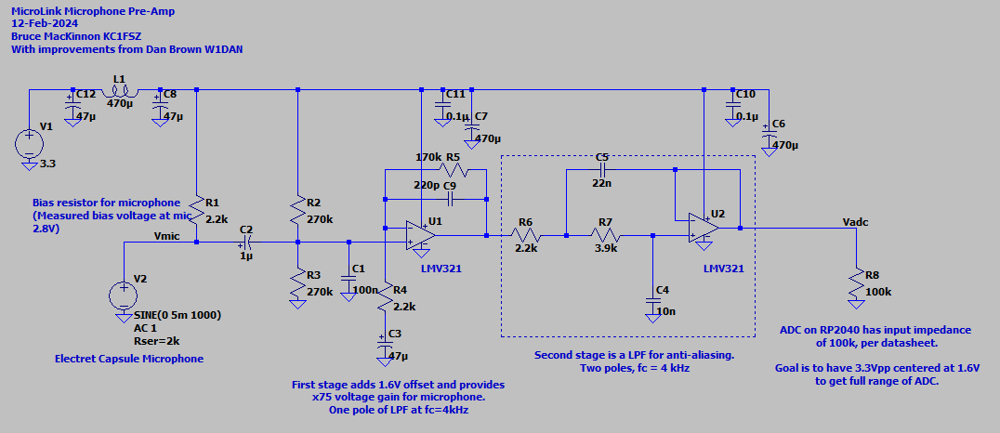

# Overview

Is it possible to build a full EchoLink&reg; node using a $4 microcontroller?  I'm not completely sure, but
let's find out. The goal of this project is to create the smallest, 
cheapest way to put a radio onto the EchoLink network. If you are new 
to the world of EchoLink please 
[see the official website](https://www.echolink.org/) for complete information. EchoLink is a 
peer-to-peer VoIP (voice over IP) network used to link amateur radio stations across
the Internet.

There are much easier ways to get onto EchoLink. The MicroLink project will only
be interesting to someone who wants to get deep into the nuts-and-bolts of EchoLink/VoIP technology. In fact, you 
should start to question the sanity of anyone who spends this much time building their own EchoLink station. I am a homebrew enthusiast and I try to avoid off-the-shelf software/components where 
possible. This has been a huge learning opportunity.

The system currently runs on a Pi Pico (RP2040) development board. I'm pretty sure it 
could also run on an ESP-32, or possibly an Arduino of the correct caliber. More experimentation
is needed here.

Here's the current demo video:

The microphone/analog section still needs a lot of work. 

The official 
PC-based EchoLink client written by Jonathan Taylor (K1RFD) is excellent and is the quickest/easiest way to get on 
EchoLink. [Download it here](https://www.echolink.org/download.htm). There are also versions that run on mobile phones. MicroLink is not a supported part of the EchoLink family 
of products.

I've learned many things about EchoLink during this project. One thing is for sure: Jonathan (K1RFD) 
who created the EchoLink system is an outstanding engineer and we should all be greatly 
appreciative of the work
that he and the rest of the EchoLink team do on behalf of the amateur radio community.

I am [good in QRZ at KC1FSZ](https://www.qrz.com/db/kc1fsz) if you have any questions or suggestions.

# Architecture Overview/Parts

My goal was to build a complete station from scratch, with no strings attached to PCs/servers.  

Once things are working smoothly I will integrate this onto a single PCB for 
ease of use with radios (link mode) and/or direct integration with repeaters.

At the moment there is no radio integration, but the final MicroLink product will provide an inexpensive interface between the internet and a radio to make linking very simple. 

This project required an in-depth examination of how the EchoLink protocol works. [The notes
I created during this analysis are located here](https://github.com/brucemack/microlink/blob/main/docs/el_supplement.md).

## Current Parts List (HW)

* The main processor is a Pi Pico (RP2040) development board.  $4.00 on DigiKey.
* Internet connectivity currently comes over WIFI using an ESP-32-WROOM development 
board. $5.00 on Amazon. Work
is underway to provide a 4G cellular data option using a SIM7600 module. More on 
this to follow.
* The microphone is an electret condenser with a LVM321 pre-amp and low-pass anti-aliasing 
filter.  The microphone part needs work.
* Audio input sampling uses the integrated ADC in the RP2040.
* Audio output generation uses the MicroChip MCP4725 I2C digital-to-analog converter.  $1.27 on DigiKey.
* Audio amplification uses the LM4862M 825mW amplifier.  $2.23 on DigiKey.
* The T/R key is from Federal Telephone and Telegraph Company (Buffalo, NY), made in 1920.  Priceless.

## Current Parts List (SW)

* The main station firmware is completely homebrew (C++, see GitHub repo).
* The ESP-32 runs the Espressif AT firmware (version 3.2.0.0).
* Importantly, audio compression/decompression uses a GSM 06-10 Full Rate CODEC which is homebrew 
in C++. Getting that to work required studying
the European Telecommunications Standards Institute specification for GSM and a lot of testing,
but this was extremely interesting.
* I'm not using the Arduino development environment for this project. The toolchain is 
CMake/GCC/GDB using the Pico 
SDK. I like this environment a lot. The firmware is flashed via SWD using [openocd](https://openocd.org/).

Here's a picture of the parts on the bench so you can tell what you're looking at.

MicroLink identifies itself using a version string of **0.02MLZ**.

## Microphone Pre-Amp

Performance audio circuits are not my forte.  The quality is improving with each 
iteration.  This is what I built originally, but a new version using parts with better noise 
specs is in the works. 

The microphone part will go away once the radio is integrated. I will probably leave
the speaker/amplifier in for monitoring purposes.

## Cellular Data Interface

The main reasons I used the ESP-32 for WIFI connectivity is the fact that the ESP AT
command set is very similar to the one supported by the SIM7600 4G cellular module.
I am currently working on a version of the MicroLink system that uses 4G internet 
connectivity. 

## Speeds and Feeds

* The standard audio sample rate for GSM-FR/EchoLink is 8 kHz at 12-bits of resolution.
* The audio CODEC creates/consumes one 640 byte packet every 80ms.  One of these packets is moved 12.5 times per second.
* It takes the RP2040 about 7ms to decode a 4x160 byte GSM frame.
* It takes the RP2040 about 30ms to encode a 4x160 byte GSM frame.
* The UDP data rate needed to sustain audio quality is 
approximately 14,000 baud.
* The RP2040 runs at 125 MHz. Only one of the two processors is used at this time.
* The DAC runs on an I2C bus running at 400 kHz.
* The ESP-32 is on a serial port that runs at 115,200 baud.

# Test Notes

## client-test-2p

This is the most comprehensive demonstration that targets the RP2040. This is 
the code shown in the video demonstration.

At the moment this uses a serial console to take commands and display 
status.

## link-test-1p

The test build for the -L station.  

At the moment this uses a serial console to take commands and display 
status.

## client-test-2

Runs on a Windows desktop, used for testing purposes only. No TX at this time.

* Set environment variables EL_CALLSIGN, EL_PASSWORD, EL_FULLNAME, EL_LOCATION.

# Technical/Development Notes

## Regarding Audio Smoothness

One of the most difficult challenges I had with this project was getting audio
that was "smooth" in both directions. This stuff is probably obvious to people
who are well versed in the state-of-the-art of VoIP, but it's all new to me.  Here
are a few points that will help anyone getting into this.

1. Accurate/consistent clocking of the audio chain is essential.  GSM uses
an 8 kHz clock, which means we need an audio sample once every
125 microseconds. I know this seems hard to believe, but inconsistencies
in this clock can be "heard."  This is where hardware timers with efficient
interrupt service architectures are important. The highest priority activity
of the microcontroller should be the creation/consumption of an audio sample
every 125 uS **exactly** - everything else in the system has some leeway.
2. An EchoLink receiver gets an audio packet _approximately_ every 80 ms.  Each 
packet contains
4 frames that each represent exactly 20 ms of audio. Finally, each frame contains 160
samples which each represent exactly 125 uS of audio.  From point #1 above, we already 
know that the timing of the 160 samples within each frame is critical.  However, 
we also need ensure that the 20 ms frames are played continuously 
**without the slighest gap between them.** This gets into an interesting problem
because the frames are streaming across the busy internet (not to mention 
low-cost WIFI hardware) and may be subject to 
small timing inconsistencies. There is simply no way to ensure that an EchoLink packet
will arrive every 80 ms. Sometimes the gap might be 81 ms, sometimes 79 ms, etc. 
This variability is known as "jitter" and it is a common issue in VoIP systems.
The fix is simple: we need to delay/buffer the audio generation in the receiver 
slighly to give ourselves a margin of error to accumulate packets. The
MicroLink system keeps a buffer of 16 audio packets and holds back the start 
of audio generation (after sqelch break) until the buffer is half full.  This 
means that the receive path is delayed by around 8 x 80 ms *above and beyond* any delay
in the Internet itself. Experimential work is ongoing to make this adaptive
so that the delay is minimized.  Of course if the buffer emplies out (i.e. several
slow packets in a row), all bets are off.

## Regarding the Pi Pico ADC

Two important things that make a difference for audio noise performance. Note
that these comments are relevant when using the Pi Pico board as-is. The 
rules will be different if using the RP2040 chip directly.

Per Pico datasheet:

> For much improved ADC performance, an external 3.0V shunt reference, such as LM4040, 
can be connected from the ADC_VREF pin to ground. Note that if doing this the ADC range 
is limited to 0-3.0V signals (rather than 0-3.3V), and the shunt reference will draw 
continuous current through the 200Ω filter resistor (3.3V-3.0V)/200 = ~1.5mA.

Per Pico datasheet:

> AGND is the ground reference for GPIO26-29, there is a separate analog ground plane 
running under these signals and terminating at this pin. If the ADC is not used or 
ADC performance is not critical, this pin can be connected to digital ground.

## Building Tests on Windows (CYGWIN)

(These notes are not comprehensive yet.)

    git clone https://github.com/brucemack/microlink.git
    cd microlink
    git submodule update --remote
    mkdir build
    cd build
    cmake ..
    make <target>

## Building on PI PICO

(These notes are not comprehensive yet.)

    git clone https://github.com/brucemack/microlink.git
    cd microlink
    git submodule update --remote
    mkdir build
    cd build
    cmake -DTARGET_GROUP=pico ..
    make <target>

## ESP32 AT Firmware Notes

    esptool.py --chip auto --port /dev/ttyUSB0 --baud 115200 --before default_reset --after hard_reset write_flash -z --flash_mode dio --flash_freq 40m --flash_size 4MB 0x0 /home/bruce/Downloads/ESP32-WROOM-32-V3.2.0.0/factory/factory_WROOM-32.bin

## Test Commands

    # Used to receive UDP packets
    netcat -u -l 5198
    # Used to send UDP packets.  The printf command supports non-printable.
    printf 'Hello\rWorld' | nc -u -w1 192.168.8.210 5198

References
==========

* Official EchoLink Site: https://www.echolink.org/
* Pi PICO Stuff
  - [Pi Pico Board Datasheet](https://datasheets.raspberrypi.com/pico/pico-datasheet.pdf?_gl=1*123mru4*_ga*MTk2NTcwODY1MS4xNzA3NDM3ODAy*_ga_22FD70LWDS*MTcwNzgyNzY3MS4xLjAuMTcwNzgyNzY3MS4wLjAuMA..)
  - [RP2040 Datasheet](https://datasheets.raspberrypi.com/rp2040/rp2040-datasheet.pdf)
  - [Hardware Design with RP2040](https://datasheets.raspberrypi.com/rp2040/hardware-design-with-rp2040.pdf)
  - [Analysis of Pico ADC](https://pico-adc.markomo.me/)
  - Timers: https://vanhunteradams.com/Pico/TimerIRQ/SPI_DDS.html
* ESP-32 
  - [AT Command Reference](https://docs.espressif.com/projects/esp-at/en/latest/esp32/AT_Command_Set/index.html)
* SIM7600 Cellular
  - SIM7600 module AT Command Reference: https://www.waveshare.net/w/upload/6/68/SIM7500_SIM7600_Series_AT_Command_Manual_V2.00.pdf
  - SIM7600 module application notes: https://www.waveshare.com/w/upload/4/4b/A7600_Series_TCPIP_Applicati0n_Note_V1.00.pdf
* Windows Audio Related: 
  - http://www.techmind.org/wave/
  - http://midi.teragonaudio.com/tech/lowaud.htm
  - http://soundfile.sapp.org/doc/WaveFormat/
* Components
  - [MCP4725 DAC](https://ww1.microchip.com/downloads/en/devicedoc/22039d.pdf)
  - [Audio Amp](https://www.ti.com/lit/ds/symlink/lm4862.pdf?HQS=dis-dk-null-digikeymode-dsf-pf-null-wwe&ts=1707335785542&ref_url=https%253A%252F%252Fwww.ti.com%252Fgeneral%252Fdocs%252Fsuppproductinfo.tsp%253FdistId%253D10%2526gotoUrl%253Dhttps%253A%252F%252Fwww.ti.com%252Flit%252Fgpn%252Flm4862)
  - [TLV9161 opamp suggested by Dan](https://www.ti.com/lit/ds/symlink/tlv9161.pdf?ts=1707743140015&ref_url=https%253A%252F%252Fwww.google.de%252F)
* Rig Integration
  - [Microphone Connector Reference](https://www.secradio.org.za/zs6src/secfiles/pdf/mic_soc_info.pdf)
  - [Baofeng Cable Reference](https://ics-ctrl.com/cable-pinout-baofeng-ht/)
* Analog/Audio
  - [Good article from Analog Devices about noise in mixed-signal systems](https://www.analog.com/media/en/analog-dialogue/volume-46/number-2/articles/staying_well_grounded.pdf)
* Other
  - [Analog Devices Filter Wizard](https://tools.analog.com/en/filterwizard/)
  - https://www.purevpn.com/what-is-vpn/protocols/openvpn
  - https://en.wikipedia.org/wiki/OpenVPN

