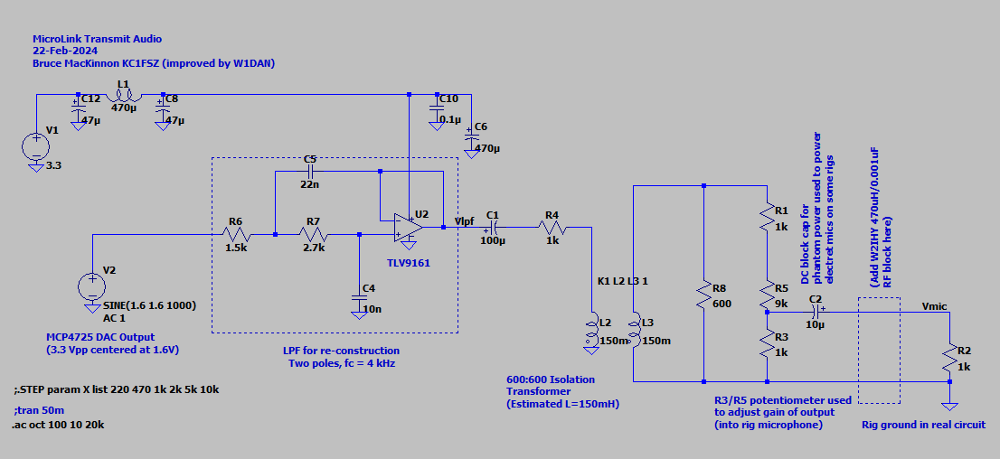

# Overview

Is it possible to build a full EchoLink&reg; node using a $6 microcontroller?  I'm not completely sure, but
let's find out. The goal of this project is to create the smallest, 
cheapest way to put a radio onto the EchoLink network. If you are new 
to the world of EchoLink please 
[see the official website](https://www.echolink.org/) for complete information. EchoLink is a 
peer-to-peer VoIP (voice over IP) network used to link amateur radio stations across
the Internet.

There are much easier ways to get onto EchoLink. The MicroLink project will only
be interesting to someone who wants to get deep into the nuts-and-bolts of EchoLink/VoIP technology. In fact, you 
should start to question the sanity of anyone who spends this much time building their own EchoLink station. I am a homebrew enthusiast and I try to avoid off-the-shelf software/components where 
possible. This has been a huge learning opportunity.

The system currently runs on a Pi Pico W (RP2040) board. I'm pretty sure it 
could also run on an ESP-32, or possibly an Arduino of sufficient caliber. More experimentation
is needed here.

Here's the current demo video:

The microphone/analog section still needs some work. 

Here's what it sounds like over the air:

Here's the setup at the moment:

The official 
PC-based EchoLink client written by Jonathan Taylor (K1RFD) is excellent and is the quickest/easiest way to get on 
EchoLink. [Download it here](https://www.echolink.org/download.htm). There are also versions that run on mobile phones. MicroLink is not a supported part of the EchoLink family 
of products.

I've learned many things about EchoLink during this project. One thing is for sure: Jonathan (K1RFD) 
who created the EchoLink system is an outstanding engineer and we should all be greatly 
appreciative of the work
that he and the rest of the EchoLink team do on behalf of the amateur radio community.

I am [good in QRZ at KC1FSZ](https://www.qrz.com/db/kc1fsz) if you have any questions or suggestions.

# Architecture Overview/Parts

My goal was to build a complete station from scratch, with no strings attached to PCs/servers.  

I have made a PCB for 
ease of use with radios (link mode) and/or direct integration with repeaters. Further refinements
of the PCB are in process.

This project required an in-depth examination of how the EchoLink protocol works. [The notes
I created during this analysis are located here](https://github.com/brucemack/microlink/blob/main/docs/el_supplement.md).

The hardware is used in two configurations:
* A link station, with integration to a radio to allow remote access.
* A client, with microphone and speaker for connecting to EchoLink conferences, links, and repeaters.

## Current Parts List (HW)

* The main processor is a Pi Pico W (RP2040) development board. This includes WIFI 
connectivity.  $6.00 on DigiKey. Work is underway to provide a 4G cellular data option 
using a SIM7600 module. More on this to follow.
* Audio output generation uses the MicroChip MCP4725 I2C digital-to-analog converter.  $1.27 on DigiKey.
* Isolation transformers and optocouplers are used to eliminate the need for common ground 
between the radio and the MicroLink system. This helps to reduce digital noise.
* The radio link is an AZDEN PCS-6000H mobile rig.
* When not using the radio:
  - Audio input sampling uses the integrated ADC in the RP2040.
  - Audio amplification uses the LM4862M 825mW amplifier.  $2.23 on DigiKey.
  - The local T/R key is from Federal Telephone and Telegraph Company (Buffalo, NY), made in 1920.  Priceless.
  - The microphone is an electret condenser with a LVM321 pre-amp and low-pass anti-aliasing 
filter.  The microphone part needs work. The next revision will use a TLV9161 op amp for the 
microphone pre-amp to reduce noise.

## Current Parts List (SW)

* The main station firmware is completely homebrew (C++, see GitHub repo).
* The LwIP embedded TCP/IP stack is used for IP connectivity on the Pi Pico W.
* Importantly, audio compression/decompression uses a GSM 06-10 Full Rate CODEC which is homebrew 
in C++. Getting that to work required studying
the European Telecommunications Standards Institute specification for GSM and a lot of testing,
but this was extremely interesting.
* I'm not using the Arduino development environment for this project. The toolchain is 
CMake/GCC/GDB using the Pico W 
SDK. I like this environment a lot. The firmware is flashed via SWD using [openocd](https://openocd.org/).

Here's a picture of the the current version of the prototype.  The Pi Pico W is on the top left.  The two wires on the right go to/from the radio.  The wires on the top left are the flash/debug interfaces which are not part of normal operation.

This is what the V0 PCB looks like:

MicroLink identifies itself using a version string of **0.02MLZ**.

## Analog Schematics

**Microphone Pre-Amp**

Performance audio circuits are not my forte.  The quality is improving with each 
iteration.  This is what I built originally, but a new version using parts with better noise 
specs is in the works. 

The microphone part will not be used when the radio is integrated. I will probably leave
the speaker/amplifier in for monitoring purposes.

**Audio Input**

This is the circuit used when connecting directly to a radio's AF output (i.e. no microphone). This repeats some of the circuit shown above (but minus the high gain). This also shows
the circuit used for carrier detect (COS). The idea is to boost up the rig's audio 
output (U6) and then compare it to an adjustable threshold (U8).  There is no debounce
in the analog part of the COS circuit - that is all done in software.

**Audio Output**

This is a work in process. The performance on the low end of the audio spectrum is not good yet.

## Cellular Data Interface

I am currently working on a version of the MicroLink system that uses 4G internet 
connectivity using a SIM7600 module.

## Speeds and Feeds

* The standard audio sample rate for GSM-FR/EchoLink is 8 kHz at 12-bits of resolution.
* The audio CODEC creates/consumes one 640 byte packet every 80ms.  One of these packets is moved 12.5 times per second.
* It takes the RP2040 about 3ms to decode a 33 byte GSM frame into PCM.
* It takes the RP2040 about 7ms to encode a 160 sample PCM frame into GSM.
* The UDP data rate needed to sustain audio quality is 
approximately 14,000 baud.
* The RP2040 runs at 125 MHz. Only one of the two processors is used at this time.
* The DAC runs on an I2C bus running at 400 kHz.
* The voice prompts (all letters, numbers, and a few words) take up about 40K of 
flash. The audio is stored in GSM full-rate format for efficiency.
* Current flash size (used) is ~650,000 bytes.

# Technical/Development Notes

## GSM CODEC

I implemented my audio compression/decompression CODEC for the GSM 0610 Full Rate 
protocol [by following the specification here](https://www.etsi.org/deliver/etsi_en/300900_300999/300961/08.01.01_60/en_300961v080101p.pdf).  The coding scheme is the so-called **Regular Pulse Excitation - Long Term 
prediction - Linear Predictive Coder**, generally referred to as "RPE-LTP."  This standard was developed
as part of the modernization of the European mobile phone system in the late 1990s and is a good
balance between efficiency, quality, and compactness. 

The European Telecommunications Standards
Institute (ETSI) publishes a comprehensive set of test vectors containing known audio streams (PCM) and the 
corresponding GSM encoding. I have used that test data to validate that my CODEC is 100% complaint.

The smallest/cheapest microcontrollers lack hardware support for floating-point, so I built my CODEC using
fixed point (Q15) math.  This was my first major foray into fixed-point DSP.

## Regarding Audio Smoothness

One of the most difficult challenges I had with this project was getting audio
that was "smooth" in both directions. This stuff is probably obvious to people
who are well versed in the state-of-the-art of VoIP, but it's all new to me.  Here
are a few points that will help anyone getting into this.

1. Accurate/consistent clocking of the audio chain is essential.  GSM uses
an 8 kHz clock, which means we need an audio sample once every
125 microseconds. I know this seems hard to believe, but inconsistencies
in this clock can be "heard."  This is where hardware timers with efficient
interrupt service architectures are important. The highest priority activity
of the microcontroller should be the creation/consumption of an audio sample
every 125 uS **exactly** - everything else in the system has some leeway.
2. An EchoLink receiver gets an audio packet _approximately_ every 80 ms.  Each 
packet contains
4 frames that each represent exactly 20 ms of audio. Finally, each frame contains 160
samples which each represent exactly 125 uS of audio.  From point #1 above, we already 
know that the timing of the 160 samples within each frame is critical.  However, 
we also need ensure that the 20 ms frames are played continuously 
**without the slightest gap between them.** This gets into an interesting problem
because the frames are streaming across the busy internet (not to mention 
low-cost WIFI hardware) and may be subject to 
small timing inconsistencies. There is simply no way to ensure that an EchoLink packet
will arrive every 80 ms. Sometimes the gap might be 81 ms, sometimes 79 ms, etc. 
This variability is known as "jitter" and it is a common issue in VoIP systems.
The fix is simple: we need to delay/buffer the audio generation in the receiver 
slightly to give ourselves a margin of error to accumulate packets. The
MicroLink system keeps a buffer of 16 audio packets and holds back the start 
of audio generation (after squelch break) until the buffer is half full.  This 
means that the receive path is delayed by around 8 x 80 ms *above and beyond* any delay
in the Internet itself. Experimental work is ongoing to make this adaptive
so that the delay is minimized.  Of course if the buffer empties out (i.e. several
slow packets in a row), all bets are off.

## Regarding the Pi Pico ADC

Two important things that make a difference for audio noise performance. Note
that these comments are relevant when using the Pi Pico board as-is. The 
rules will be different if using the RP2040 chip directly.

Per Pico datasheet:

> For much improved ADC performance, an external 3.0V shunt reference, such as LM4040, 
can be connected from the ADC_VREF pin to ground. Note that if doing this the ADC range 
is limited to 0-3.0V signals (rather than 0-3.3V), and the shunt reference will draw 
continuous current through the 200Ω filter resistor (3.3V-3.0V)/200 = ~1.5mA.

Per Pico datasheet:

> AGND is the ground reference for GPIO26-29, there is a separate analog ground plane 
running under these signals and terminating at this pin. If the ADC is not used or 
ADC performance is not critical, this pin can be connected to digital ground.

## Building the Link Station

This is the official binary that runs in production.

(These notes are not comprehensive yet.)

    git clone https://github.com/brucemack/microlink.git
    cd microlink
    git submodule update --remote
    mkdir build
    cd build
    export PICO_BUILD=1
    cmake -DPICO_BOARD=pico_w ..
    make link-main-2
    openocd -f interface/raspberrypi-swd.cfg -f target/rp2040.cfg -c "program link-main-2.elf verify reset exit"
   
## Building Tests on Windows (CYGWIN)

(These notes are not comprehensive yet.)

    git clone https://github.com/brucemack/microlink.git
    cd microlink
    git submodule update --remote
    mkdir build
    cd build
    cmake ..
    make <target>

## ESP32 AT Firmware Notes

(No longer used)

    esptool.py --chip auto --port /dev/ttyUSB0 --baud 115200 --before default_reset --after hard_reset write_flash -z --flash_mode dio --flash_freq 40m --flash_size 4MB 0x0 /home/bruce/Downloads/ESP32-WROOM-32-V3.2.0.0/factory/factory_WROOM-32.bin

## Test Commands

    # Used to receive UDP packets
    netcat -u -l 5198
    # Used to send UDP packets.  The printf command supports non-printable.
    printf 'Hello\rWorld' | nc -u -w1 192.168.8.210 5198

    # Login test
    printf "lKC1FSZ\254\254xxx\rONLINE0.02MLZ(08:11)\rWellesley, MA USA\r" | nc -w 10 naeast.echolink.org 5200

    # SIM7600 open TCP socket in transparent mode:
    ATE0;+CIPMODE=1;+NETOPEN;+CIPOPEN=0,"TCP","54.89.121.215",8100

# Rig Integration Notes

## Baofeng BF-F8HP HT

### Connectors

* 3.5mm Jack
  - Tip - NC
  - Ring - Rig mic in, MicroLink audio out
  - Sleeve - PTT when pulled to ground
* 2.5mm Jack
  - Tip - Rig speaker+ out, MicroLink audio in
  - Ring - Rig ground
  - Sleeve - Rig ground

### Carrier Detect

This has been discussed at length in other venues.  The method of detecting the 
receive carrier depends on the radio you are using.  Unless you are willing 
to crack it open, there is no explicit carrier detect "signal" on the Baofeng HT.  My 
integration with this rig just listens for noise on the audio output line
and triggers accordingly.  That seems to work just fine.  See the schematic for 
details.

## Notes Regarding Interface with MCP4725

The RP2040 has no DAC and the MCP4725 is cheap and plentiful. This could certainly be 
done with a fancier audio CODEC, but we'll think about that later.

As mentioned previously, it is important to deliver audio very smoothly, and with 
as little CPU overhead as possible.  To that end, we are leveraging the TX FIFO 
on the I2C channel to quickly write to the I2C bus without any blocking.  

This is a bit tricky because there are two completely independent data formats
that need to work together:
* The RP2040 I2C format (really the DW_apb_i2c format) that is manifest in the 
format of the IC_DATA_CMD register.  Aside from the "normal" byte of data in this 
register, we have extra bits that control the START/STOP/RESTART cycles of the 
I2C bus.  Each write to the I2C_DATA_CMD register contributes both 
data bits and control bits.
* THe MCP4725 I2C format.  This is a 12-bit DAC, but it's not as simple as
justing writing 12 bits to it.  There are other control bits in the message
being sent to the MCP4725 on the I2C bus and those need to be configured
properly.

The DAC I2C writes are done inside of the same interrupt service routine that performs 
the ADC read. This interrupt is set to run at exactly 8kHZ by setting the ADC 
FIFO depth to 1. The ADC and DAC are both running constantly, regardless of whether
the system is transmitting or receiving.

### Bus Protocol

There are some different ways of using the I2C bus but we're using the 
simple way since speed is not a big issue.  What we really care about 
is consistency. Each audio sample will be transmitted
on the I2C bus using a normal START-address-data-STOP sequence. There are fancier 
things you can do on the I2C bus involving restarts but we don't need that
for our audio bandwidth requirements.  

The MCP4725 also provides some choices to improve efficiency.  The "fast mode" 
described in section 6.1.1 of [the datasheet](https://ww1.microchip.com/downloads/en/devicedoc/22039d.pdf) 
allows you to perform continuous data writes without addressing cycles. We don't 
need that for the 8kHz application (at least I don't think we do).

In the "slow" mode, the MCP4725 needs the regular I2C address byte followed
by three data bytes.  Actually, the first of the three data bytes is more 
like a command byte from the perspective of the MCP4725. So the complete
sequence will need to look like this:

* -> I2C START
* -> Address Byte (MCP4725 "first byte")
* <- I2C ACK
* -> Data Byte 0 (MCP4725 "second byte")
* <- I2C ACK
* -> Data Byte 1 (MCP4725 "third byte")
* <- I2C ACK
* -> Data Byte 2 (MCP4725 "fourth byte")
* <- I2C ACK
* -> I2C STOP

The START and STOP steps are commanded by bits in the RP2040 I2C_DATA_CMD word
so they don't require distinct writes to the TX FIFO. Likewise, the address
byte is generated automatically on start.  In order to achieve 
the sequence above we'll need to make three distinct data writes into the I2C
TX FIFO for each audio sample.

Combining the RP2040 datasheet figure 72 and the MCP4725 figure 6-2, we
can determine that the three writes will look like this:

    0 0 0 | 0   1   0   x   x   0   0   x 
    0 0 0 | d11 d10 d09 d08 d07 d06 d05 d04
    0 1 0 | d03 d02 d01 d00 x   x   x   x

These writes are happening into the LSB end of the I2C_DATA_CMD
register (i.e. data bits [10-0]).  Bits [31-11] are not used and
will be set to zero.  The x's in the illustration above show 
where the MCP4725 has don't-cares.  These will be set to zero.

## Notes on DTMF Detection

The rules for DTMF are standardize by the International Telecommunications Union (ITU). The relevant 
standards documents are located here:
* [ITU Q.23](https://www.itu.int/rec/dologin_pub.asp?id=T-REC-Q.23-198811-I!!PDF-E&lang=e&type=items)
* [ITU Q.24](https://www.itu.int/rec/dologin_pub.asp?lang=e&id=T-REC-Q.24-198811-I!!PDF-E&type=items)

The most important details from the standards document:

* There are a total of 16 possible symbols.  Each symbol is made up of two tones: one from the "low group"
and one from the "high group."
* The "low group" frequencies are: 697, 770, 852, 941 Hz.  These are on the rows of the keypad.
* The "high group" frequencies are: 1209, 1336, 1477, 1633 Hz.  These are on the columns of the keypad.
* Even though the phone/radio keypad only has 3 columns, there is a an "extra" column in the spec
for A/B/C/D.
* Transmission must be within 1.8% of frequency standard to be recognized.  This means that the received 
frequency can be +/- 1.8% from expectation, or 3.6% wide.  
* If we apply the 3.6% rule to the highest frequency, we get a resolution bandwidth of 58.788 Hz (1633 * 0.036).
* Distortion products (e.g. harmonics) must be -20dB below the fundamental.
* There are rules around the relative powers of the two tones that make up the symbol. In the US, 
the high group frequency power level may be up to 4 dB more or 8 dB less than the low group frequency 
power level for the symbol to be considered valid.  In the TELCO lingo, this difference is known as
"twist" and it is expressed in dB.  Positive twist means that the higher frequency is louder.
* Timing requirements are as follows.
  - A symbol must be transmitted for at least 40ms.  Symbols shorter than 23ms must be rejected.
  - The gap between symbols must be at least 40ms.

### Implementation Notes

* 23ms is 184 samples at a sampling rate of 8 kHz.  We will round this to 20ms (160 samples) since it 
is conveniently the same size as a GSM frame.
* 40ms is 320 samples at a sampling rate of 8 kHz
* A block of 136 samples is required to achieve 58.788 Hz resolution at a sampling rate of 8 kHz.  If
we use more than 136 samples then the resolution will become finer than 58 Hz and we'll need to compute
the power in more than one bucket - so we don't want to do that.
* So for each 160 sample frame we will use the latest 136 samples and ignore the other 24.  Close
enough.
* We will look for symbols that last more than two 160 sample frames.
* We will look for noise periods that last more than two 160 sample frames to consider the symbol valid
(i.e. the pause).
* Algorithm notes:
  - For each 160 samples.
  - Evaluate power at all 8 frequencies.
  - Compare the power of all 16 pairs by summing powers at each intersection.
  - Look to see if any pairs stand out by at least +20dB.  If so, that is the candidate pair.
  - Check the twist on the candidate pair to make sure it falls within the +4dB -> -8dB standard.
  - Compute the harmonic power for both frequencies in the pair and make sure it falls below the -20dB standard.
  - If all tests pass, then do the 40ms duration checks.
* The +4dB level is equivalent to x ~1.58 linear.  Testing a/b > ~1.58 is the same as testing 4a/b > ~6.
* The +8dB level is equivalent to x ~2.5 linear.  Testing a/b > ~2.5 is the same as testing 4a/b > ~10.

# References

* Official EchoLink Site: https://www.echolink.org/
* Pi PICO Stuff
  - [Pi Pico Board Datasheet](https://datasheets.raspberrypi.com/pico/pico-datasheet.pdf?_gl=1*123mru4*_ga*MTk2NTcwODY1MS4xNzA3NDM3ODAy*_ga_22FD70LWDS*MTcwNzgyNzY3MS4xLjAuMTcwNzgyNzY3MS4wLjAuMA..)
  - [RP2040 Datasheet](https://datasheets.raspberrypi.com/rp2040/rp2040-datasheet.pdf)
  - [Hardware Design with RP2040](https://datasheets.raspberrypi.com/rp2040/hardware-design-with-rp2040.pdf)
  - [Analysis of Pico ADC](https://pico-adc.markomo.me/)
  - Timers: https://vanhunteradams.com/Pico/TimerIRQ/SPI_DDS.html
  - Flash Write: https://github.com/raspberrypi/pico-examples/blob/master/flash/program/flash_program.c
* Pi PICO W Stuff
  - [Pi Pico W Datasheet](https://datasheets.raspberrypi.com/picow/pico-w-datasheet.pdf?_gl=1*szg9*_ga*MTA2NTQyMTI1OC4xNjg3MjAzNjgy*_ga_22FD70LWDS*MTcwOTU1NTA2OC4yMi4xLjE3MDk1NTUzODEuMC4wLjA.)
  - [Connecting to the Internet with the Pico W](https://datasheets.raspberrypi.com/picow/connecting-to-the-internet-with-pico-w.pdf)
  - [Pi Pico CYW43 Driver Docs](https://cec-code-lab.aps.edu/robotics/resources/pico-c-api/group__cyw43__driver.html#ga71e656d02aabca214ae344f29ae1d033)
  - [Light Weight IP - LwIP API Documentation](https://www.nongnu.org/lwip/2_1_x/index.html)
* ESP-32 
  - [AT Command Reference](https://docs.espressif.com/projects/esp-at/en/latest/esp32/AT_Command_Set/index.html)
* SIM7600 Cellular
  - SIM7600 module AT Command Reference: https://www.waveshare.net/w/upload/6/68/SIM7500_SIM7600_Series_AT_Command_Manual_V2.00.pdf
  - SIM7600 module application notes: https://www.waveshare.com/w/upload/4/4b/A7600_Series_TCPIP_Applicati0n_Note_V1.00.pdf
  - [SIM7600 Hardware Design Guide](https://edworks.co.kr/wp-content/uploads/2022/04/SIM7600_Series_Hardware_Design_V1.08.pdf)
* Windows Audio Related: 
  - http://www.techmind.org/wave/
  - http://midi.teragonaudio.com/tech/lowaud.htm
  - http://soundfile.sapp.org/doc/WaveFormat/
* Components
  - [Transformer that W2IHY is using](https://www.digikey.com/en/products/detail/triad-magnetics/TY-304P/242649)
  - [MCP4725 DAC](https://ww1.microchip.com/downloads/en/devicedoc/22039d.pdf)
  - [Audio Amp](https://www.ti.com/lit/ds/symlink/lm4862.pdf?HQS=dis-dk-null-digikeymode-dsf-pf-null-wwe&ts=1707335785542&ref_url=https%253A%252F%252Fwww.ti.com%252Fgeneral%252Fdocs%252Fsuppproductinfo.tsp%253FdistId%253D10%2526gotoUrl%253Dhttps%253A%252F%252Fwww.ti.com%252Flit%252Fgpn%252Flm4862)
  - [TLV9161 opamp suggested by Dan](https://www.ti.com/lit/ds/symlink/tlv9161.pdf?ts=1707743140015&ref_url=https%253A%252F%252Fwww.google.de%252F)
  - [NTE3086 Optoisolator, 8-DIP](https://www.nteinc.com/specs/3000to3099/pdf/nte3086.pdf)  
  - [EL357M Optoisolator, plentiful on JLCPCB](https://jlcpcb.com/partdetail/EverlightElec-EL357N_C_TA_G/C29981#:~:text=Datasheet-,Download,-Source)
  - [NCP1117 LDO Voltage Regulator used in circuit](https://www.onsemi.com/pdf/datasheet/ncp1117-d.pdf)
* Rig Integration
  - [Microphone Connector Reference](https://www.secradio.org.za/zs6src/secfiles/pdf/mic_soc_info.pdf)
  - [Baofeng Cable Reference](https://ics-ctrl.com/cable-pinout-baofeng-ht/)
* Analog/Audio
  - [Good article from Analog Devices about noise in mixed-signal systems](https://www.analog.com/media/en/analog-dialogue/volume-46/number-2/articles/staying_well_grounded.pdf)
  - [Good article about ferrite beads, and power supply noise more generally](https://northcoastsynthesis.com/news/the-truth-about-ferrite-beads-will-shock-you/)
  - [Detailed article about audio/rig integration](https://www.zs2ez.co.za/Soundcard/Soundcard.htm)
  - [Linear Predictive Coding of Speach](https://course.ece.cmu.edu/~ece792/handouts/RS_Chap_LPC.pdf)
* DSP Related
  - [A useful article on implementing the Goertzel Algorithm in fixed point](https://remcycles.net/blog/goertzel.html)
  - [Very good article on Fixed Point Math by Randy Yates](http://www.digitalsignallabs.com/downloads/fp.pdf)
  - [Another Randy Yates paper on fixed point FIR](http://www.digitalsignallabs.com/downloads/fir.pdf)
  - [DSP Text Book](https://brianmcfee.net/dstbook-site/content/intro.html)
* DTMF Related
  - [Official ITU Q.23 Standard](https://www.itu.int/rec/dologin_pub.asp?id=T-REC-Q.23-198811-I!!PDF-E&lang=e&type=items)
  - [Official ITU Q.24 Standard](https://www.itu.int/rec/dologin_pub.asp?lang=e&id=T-REC-Q.24-198811-I!!PDF-E&type=items)
  - [A TI application note on DTMF detection](https://www.ti.com/lit/an/spra096a/spra096a.pdf?ts=1709132288428&ref_url=https%253A%252F%252Fwww.google.com%252F)  
* Other
  - [Analog Devices Filter Wizard](https://tools.analog.com/en/filterwizard/)
  - https://www.purevpn.com/what-is-vpn/protocols/openvpn
  - https://en.wikipedia.org/wiki/OpenVPN
  - https://www.analog.com/media/en/technical-documentation/application-notes/an-1368.pdf
  - [Information about Ferite Beads from Altium](https://resources.altium.com/sites/default/files/2022-05/Guide%20to%20Using%20Ferrite%20Beads%20in%20a%20PCB.pdf). 
  - MD5 Implementation: https://www.cs.cmu.edu/~jcl/linux/seal/md5.c
  - Audio Transformer: https://electronics.stackexchange.com/questions/648953/what-does-the-impedance-value-of-audio-transformers-specifically-mean-in-terms
  - Very interesting audio processing stuff: https://www.repeater-builder.com/tech-info/audio-processing.html
  - [Ceramic vs Tantalum Capacitors in LDOs](https://www.ti.com/lit/an/slva214a/slva214a.pdf)
