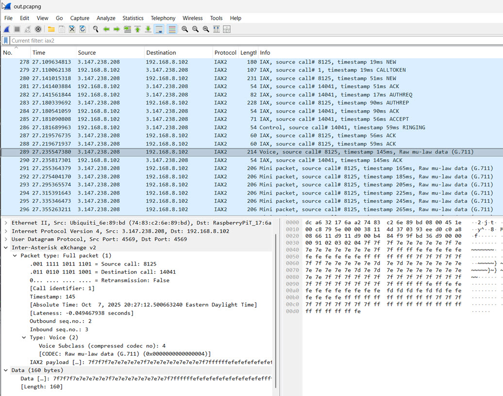
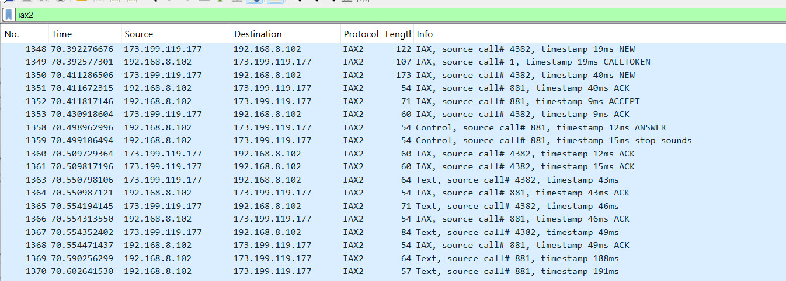
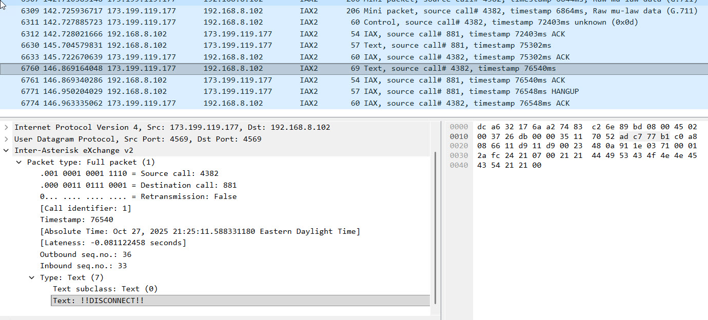

# AllStarLink Protocol Information 

[By Bruce MacKinnon, KC1FSZ](https://www.qrz.com/db/kc1fsz)

## Network Information

IAX2 runs on UDP port 4569. This is the only port that needs to be open from the outside.

## ASL Node Query

An HTTP get of this format: http://stats.allstarlink.org/api/stats/61057 will return a JSON message like this:

```json
{
    "stats":{
        "id":31620,
        "node":61057,
        "data": {
            "apprptuptime":"409053",
            "totalexecdcommands":"0",
            "totalkeyups":"0",
            "totaltxtime":"0",
            "apprptvers":"3.5.5",
            "timeouts":"0",
            "links":[],
            "keyed":false,
            "time":"1761566153",
            "seqno":"13638",
            "nodes":null,
            "totalkerchunks":"0",
            "keytime":"409063",
            "linkedNodes":[]
        },
        "created_at":"2024-04-03T15:06:30.000000Z",
        "updated_at":"2025-10-27T11:55:53.000000Z",
        "user_node":{
            "Node_ID":74479,
            "User_ID":"KC1FSZ",
            "Status":"Active",
            "name":"61057",
            "ipaddr":"108.20.174.63",
            "port":4569,
            "regseconds":1761438377,
            "iptime":"2025-10-07 19:49:05",
            "node_frequency":"",
            "node_tone":"",
            "node_remotebase":false,
            "node_freqagile":"0",
            "callsign":"KC1FSZ",
            "access_reverseautopatch":"0",
            "access_telephoneportal":"1",
            "access_webtransceiver":"1",
            "access_functionlist":"0",
            "is_nnx":"No",
            "server":{
                "Server_ID":44296,
                "User_ID":"KC1FSZ",
                "Server_Name":"microlink-1",
                "Affiliation":"",
                "SiteName":"",
                "Logitude":"-71.29633",
                "Latitude":"42.290464",
                "Location":"Wellesley\/MA",
                "TimeZone":null,
                "udpport":4569,
                "proxy_ip":null
            }
        }
    },
    "node":{
        "Node_ID":74479,
        "User_ID":"KC1FSZ",
        "Status":"Active",
        "name":"61057",
        "ipaddr":"108.20.174.63",
        "port":4569,
        "regseconds":1761564172,
        "iptime":"2025-10-07 19:49:05",
        "node_frequency":"",
        "node_tone":"",
        "node_remotebase":false,
        "node_freqagile":"0",
        "callsign":"KC1FSZ",
        "access_reverseautopatch":"0",
        "access_telephoneportal":"1",
        "access_webtransceiver":"1",
        "access_functionlist":"0",
        "is_nnx":"No",
        "server":{
            "Server_ID":44296,
            "User_ID":"KC1FSZ",
            "Server_Name":"microlink-1",
            "Affiliation":"",
            "SiteName":"",
            "Logitude":"-71.29633",
            "Latitude":"42.290464",
            "Location":"Wellesley\/MA",
            "TimeZone":null,
            "udpport":4569,
            "proxy_ip":null
        }
    },
    "keyups":[],
    "time":1.2359619140625
}
```

## Node Registration

A JSON message is sent to the AllStarLink registry
when a node starts up.  This registration allows the 
network to know the IP address that the node is running
on. It's likely that this message is sent out on a 
periodic basis to keep the registration active.

The format of this JSON message doesn't appear to be directly
documented, but it can be determined from looking at the 
source code.

Here's an example of a command that will send the 
properly formatted message:
```
curl -X POST "register.allstarlink.org" \
     -H "Content-Type: application/json" \
     -d '{ 
    "port": 7777,
    "data": { 
        "nodes": { 
            "61057": { 
                "node": "61057", 
                "passwd": "xxxxxx", 
                "remote": 0 
            } 
        } 
    } 
} 
' \
     --trace allstarlink.log
```
Here's the JSON message (the important part):
```json
{
    "port": 7777,
    "data": {
        "nodes": {
            "61057": {
                "node": "61057",
                "passwd": "xxxxxx",
                "remote": 0
            }
        }
    }
}
```

## Audio Notes

The audio sample rate is 8kHz. Block size is 160. So each block represents 20ms
of audio.

G.711 mu-law audio data 

## Message Flows 

### Call from AllStarLink Telephone Portal

A network capture was made of a node receiving a call from the AllStarLink
Telephone Portal. In WireShark it looks like this:



* (From Caller) Full Packet, Type=Control(4), Subclass=NEW
* (To Caller)  Full Packet, Type=Control(4), Subclass=CALLTOKEN
* (From Caller) Full Packet, Type=Control(4), Subclass=NEW
* (To Caller) ACK
* (To Caller) AUTHREQ
* (From Caller) AUTHREP
* (To Caller) ACK
* (To Caller) ACCEPT
* (To Caller) Full Packet, Type=Control(4), Subclass=RINGING
* (From Caller) Full Packet, Type=IAX(6), Sublcass=ACK
* (From Caller) Full Packet, Type=IAX(6), Sublcass=ACK
* (From Caller) Full Packet, Type=Voice(2)
* (To Caller) Type=IAX(6), Sublcass=ACK(4)
* (From Caller) Mini voice packet
* (From Caller) Mini voice packet
* ...
* (To Caller) Full Packet, Type=Control(4), Subclass=ANSWER
* (To Caller) Full Packet, Type=Control(4), Subclass=Stop Sounds

### Call From Another ASL Node

I connected to node 29999 using the telephone portal and pressed *361057 to
request a connection to my 61057 node. 



Notes:
* The usual CALLTOKEN challenge is used on the first NEW.
* The second NEW contains 
  - An IE with the username (6) of "radio"
  - An IE with the desired CODEC
* There is no AUTHREQ/AUTHREP challenge. It appears that the connection
from the remote note is unauthenticated.
* No RINGING phase. The ANSWER/stop sounds is sent immediately after the ACCEPT.
* At the very start of the call we received these TEXT packet:
    - !NEWKEY!
    - T 29999 COMPLETE
    - T 29999 CONNECTED,29999,61057
* For more information about the TEXT protocol see: https://wiki.allstarlink.org/wiki/IAX_Text_Protocol
* The "T" messages are telemetry. See: https://allstarlink.github.io/adv-topics/telemetry/.
One important thing is that it is up to the receiving node to decide what to 
do with these messages (for example, announce them). One of the documents mentions
that a T STATUS message is sent in response to a *70 DTMF command, which makes
me wonder whether the voicing of this information is completely local?
* Per documentation "There are several messages being exchanged that alter the 
behavior of the app_rpt application. It's unclear as to their purpose ... !NEWKEY!
is meant to be some sort of handshake. When a party receives this command it should 
send it back."
* Immediately after receiving those TEXT packets, the following was sent, which 
is consistent with the above comment in the docs:
    - !NEWKEY!
* There are some TEXT packets exchanged every 10 seconds. It looks like 
a text packet with "L" is being sent every ~10 seconds. And from 29999 we get this
every ~10 seconds:

        L R1010,TKC1FSZ-P,T29283,T48335,T29285,T1951,T29284,T49999,T1980,T1950,R1020

which is the list of notes currently connected. Per documentation _"Sent periodically by a node to broadcast all node linked to it."_
* On remote-initiated disconnect a TEXT message is received: !DISCONNECT!
* Immediately after the !DISCONNECT! is received a HANGUP is sent from local->remote.



## Sequence Number Notes

* When a NEW is received, reset the inbound inbound_expected_seq to 1 (i.e next message).
* When a NEW is received, reset the outbound_seq to 1.
* When sending a frame, set the ISeqno field to inbound_expected_seq.
* When sending any frame send outbound_seq in the OSeqno field. After sending a frame **that is not an ACK** increment outbound_seq field. 
* When a full frame is received, check the OSeqno field vs the expected value and increment the inbound_expected_seq.

## Message Format/Semantics

### NEW

Used to initiate a call. This actually comes in twice, once at the very 
beginning and once after a CALLTOKEN challenge is issued.

### CALLTOKEN 

Used to respond to an initial NEW request. Tells the the originator that
a call token will be required in the NEW retry.

### Voice Packet (Full)

G.711 μ-law payload contains the actual 8-bit μ-law encoded audio samples. The size of 
this payload depends on the packetization interval.  20ms of audio at 8kHz a sampling
rate is 160 bytes.

### Voice Packet (Mini)

At least one full voice packet must be sent before a mini packet is allowed. 

A full voice packet is required when 16-bit timestamp of the mini packet wraps around
to zero.

### AUTHREQ

Sent from the server to the client to request authentication. Contains a 9-digit challenge,
which is a random number.

### AUTHREP

Send from the client to the server in response to an AUTHREQ.

Contains the RSA signature for the server's challenge. This is Base-64 encoded. The 
signature will be validated by the server using a public RSA key. Digest hash is SHA1.

Sample code to illustrate the mechanics:

```python
"""
This is a demonstration of the challenge validation process 
used by AllStarLink (IAX2).

Copyright (C) 2025, Bruce MacKinnon KC1FSZ
"""
import base64
from cryptography.hazmat.primitives import hashes
from cryptography.hazmat.primitives.asymmetric import padding
from cryptography.hazmat.primitives.asymmetric import rsa
from cryptography.hazmat.primitives import serialization
from cryptography.exceptions import InvalidSignature

"""
From RFC-5456, Section 8.6.16:

The purpose of the RSA RESULT information element is to offer an RSA
response to an authentication CHALLENGE.  It carries the UTF-8-
encoded challenge result.  The result is computed as follows: first,
compute the SHA1 digest [RFC3174] of the challenge string and second,
RSA sign the SHA1 digest using the private RSA key as specified in
PKCS #1 v2.0 [PKCS].  The RSA keys are stored locally.

Upon receiving an RSA RESULT information element, its value must be
verified with the sender's public key to match the SHA1 digest
[RFC3174] of the challenge string.
"""

# The RSA public key is provided in the ASL3 installation. On the Pi
# appliance distribution it is located at:
#   /usr/share/asterisk/keys/allstar.pub
# The public key is in PEM format:
public_key_pem = "-----BEGIN PUBLIC KEY-----\n\
MIGfMA0GCSqGSIb3DQEBAQUAA4GNADCBiQKBgQCu3h0BZQQ+s5kNM64gKxZ5PCpQ\n\
9BVzhl+PWVYXbEtozlJVVs1BHpw90GsgScRoHh4E76JuDYjEdCTuAwg1YkHdrPfm\n\
BUjdw8Vh6wPFmf3ozR6iDFcps4/+RkCUb+uc9v0BqZIzyIdpFC6dZnJuG5Prp7gJ\n\
hUaYIFwQxTB3v1h+1QIDAQAB\n\
-----END PUBLIC KEY-----\n"
public_key = serialization.load_pem_public_key(public_key_pem.encode("utf-8"))

# The RSA challenge string is a 9-digit number created randomly by 
# the server creating the AUTHREQ message. Here is an example that 
# was captured from the network during an actual connection:
rsa_challenge = "570639908"

# The RSA signature is created by the client attempting to connect.
# This is created using the client's private key. The signature
# is sent back in the AUTHREP message. Here is an example that
# was captured from the network during an actual connection:
rsa_challenge_result_base64 = "ZanWw1+Wx5TWWX6g4890bmnflMgk8ZyyRdjINenNmzq3eYWfPMpcfMFIrHfX0gxOzGeNflcbOqr1m6GMnCoE92h+fMlIEZceUuCZXh+GZ4ywiy3RJluvE/Cj/vkh5Af38jb5PjT2dJB/HMZ8mSZ7qDQgcjjotNRmWVGhAMte9Nc="

# The signature in the AUTHREP message is actually a base-64 encoding 
# of the signature:
rsa_challenge_result = base64.b64decode(rsa_challenge_result_base64.encode("utf-8"))

# Here is where the actual validation happens:
public_key.verify(rsa_challenge_result,
    rsa_challenge.encode("utf-8"), 
    padding.PKCS1v15(), 
    hashes.SHA1())

# If we get here the validation is good, otherwise an exception is raised
print("AUTHREP signature validated, all good!")
```
## CODEC Negotiation

The protocol supports CODEC negotiation.  

The caller specifies the supported CODECs in the NEW 
message. The NEW message MUST specify the list of
supported CODECs using the format IE.

The CODEC designators are defined [in section 8.7 on
Media Formats](https://datatracker.ietf.org/doc/html/rfc5456#section-8.7). A bitmap is used to allow
multiple CODECs to be specified at the same time.

The server designates the chosen CODEC in the ACCEPT
message. An ACCEPT message MUST include the 'format' 
IE to indicate its desired CODEC to the originating 
peer.  The CODEC format MUST be one of the formats
sent in the associated NEW command.

# References

* [A good blog analysis on INVITE flow](https://blog.wildix.com/sip-invite-method/)
* [A good blog on SDP format](https://andrewjprokop.wordpress.com/2013/09/30/understanding-session-description-protocol-sdp/)
* https://aosabook.org/en/v1/asterisk.html
* [ASL #Slack](https://allstarlink.slack.com/)
