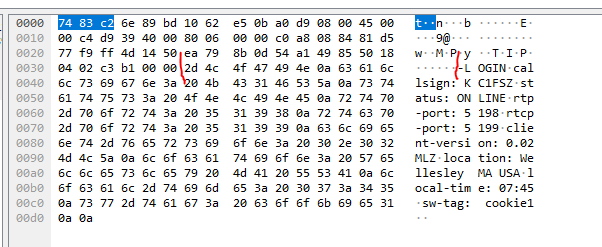
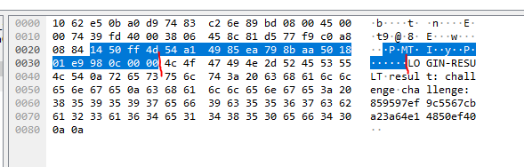
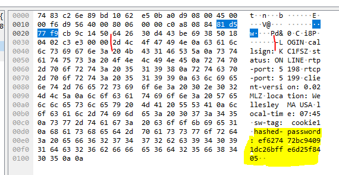
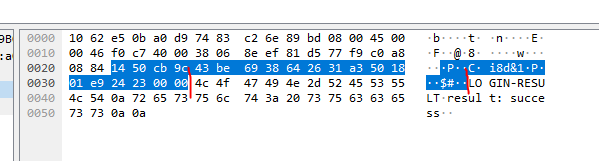
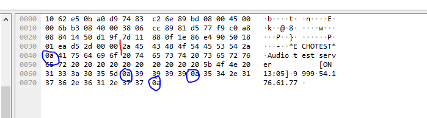

# EchoLink Protocol Information 

[By Bruce MacKinnon, KC1FSZ](https://www.qrz.com/db/kc1fsz)

As far as I can tell the EchoLink&reg; protocol isn't officially documented. Maybe I'm missing something. This page attempts 
to fill in the details. My 
notes are based on examinations of EL packet captures and a review of the various open source EchoLink implementations in GitHub. I 
am not affiliated with the EchoLink team and I have no inside information.  Please take these notes for what they are 
worth - just one random ham's observations.  Do your own research.

_NOTE from 20-Feb-2024: I later received some very helpful comments/input from the EchoLink creator Jonathan Taylor (K1RFD), 
and he helped to fill in some places where I lacked visibility.  Please don't assume that 
this document has been fully reviewed and/or endorsed by Jonathan, but I will credit him in some of the 
new sections below._

_NOTE: Thanks also to Scott Miller (N1VG) who filled in a few details.  Scott's firm (Agent Data Systems, Inc.)
sells an interesting piece of EchoLink hardware called EchoBridge.  Check it out._

Notes like these may make it possible for others to start tinkering around in EchoLink space. If you do so, **please proceed
with caution.** We all love EchoLink but none of us pay when we use it, so I can only assume that there are many volunteer hours 
going on behind the scenes. The last thing anyone needs is an accidental denial-of-service incident on the EL network. I
would strongly encourage anyone attempting to implement their own EchoLink hardware/software to reach out to the 
EchoLink team first to discuss your idea.

The information on this page was used to homebrew a working EchoLink&reg; station called MicroLink.  [The code/information 
is here](https://github.com/brucemack/microlink).

If you have any questions/corrections/concerns on this 
document please contact me directly (good in QRZ). Don't bother the real 
EchoLink team since they have plenty to do running a massive 
telephony network and they don't need to be spending time correcting my errors.

Here are links to some GitHub projects that I've studied:

* Echolib: https://github.com/sm0svx/svxlink/tree/master/src/echolib
* TheBridge: https://github.com/wd5m/thebridge-1.09
* Asterisk Interface: https://github.com/hwstar/astsrc-1.4.23-pre/blob/master/asterisk/channels/chan_echolink.c

The EL protocols draw heavily on VoIP technology, specifically the RTP and RTCP standards. Documentation of these two standards helps a lot, but should not be taken too literally as the EL standards do things a bit differently in a few places. Some related standards docs 
that I would recommend looking at:

* RFC 3550 (RTP): https://datatracker.ietf.org/doc/html/rfc3550
* RTCP Background: https://en.wikipedia.org/wiki/RTP_Control_Protocol
* RFC 8852 (RTCP SDES): https://datatracker.ietf.org/doc/rfc8852/
* GSM 06.10 Full-Rate: https://www.etsi.org/deliver/etsi_EN/300900_300999/300961/08.00.01_40/en_300961v080001o.pdf

## High-Level Protocol Flow Notes

As has been documented in several places, there are two distinct protocol flows that make up the EL system:
* A client/server interaction with one of the EchoLink servers (TCP port 5200).
* A peer-to-peer "QSO" interaction between EchoLink nodes:
  - UDP port 5198 is used to carry audio traffic (and a bit of out-of-band texting) using the RTP protocol.
  - UDP port 5199 is used to carry session control information using something very similar to the RTCP protocol.

The topic of EchoLink Proxies will be put aside for now - more on this later.

Before getting into the details I'll provide my understanding of the high-level message flow that is used
during an EL QSO.  EchoLink is a peer-to-peer technology so it's probably not correct to think about "clients" 
and "servers" for most in this flow.  Instead I will use the terms "Station A" and "Station B," assuming that 
Station A is the originator of the call. From tracing a QSO using the official EchoLink client I can see the 
following flow pattern:

1. Station A logs into the network by interacting with the EchoLink Server over TCP port 5200.  This 
step may not need to happen on every QSO since the logged-on status persists for some time.
2. Station A requests the directory information from the EchoLink Server to determine the 
status of the target node and its current IP address.
3. Station A sends an RTCP SDES packet with the identification information to Station B on the RTCP port, **but using 
the socket that is bound to the RTP port on the local side!**.  I suspect we need to originate data using both local-side 
UDP ports in order for routers/firewalls to forward return traffic from Station B back to Station A on both ports.  This is related to dynamic firewall capability known as [Stateful Packet Inspection](https://en.wikipedia.org/wiki/Stateful_firewall) and/or [UDP Hole Punching](https://en.wikipedia.org/wiki/UDP_hole_punching).
4. Station A sends the same message again to the RTCP port of Station B using the socket that is bound to the RTCP port.
5. Station A sends an oNDATA packet to the RTP port of Station B.
6. Station A appears to wait at this point.  If nothing happens after 5 seconds then a retry happens by returning to step #3.
7. Station B uses the call-sign provided in the RTCP SDES message sent in step 4 to contact
the EchoLink Server and validate that the Station A user is authorized to use the network. (I'm told that Station B also 
maintains a cache of recently-validated stations to reduce the number of validation calls.  Presumably there is a reasonable
time-to-live on this caching mechanism so that invalid callsigns will not be allowed to stay on the network for long.)
8. Station B sends an RTCP SDES packet on the RTCP channel.
9. Station B sends an oNDATA packet on the RTP channel.
10. Station A sends the same RTCP SDES packet from step #3/#4.  (I suspect this is actually the first of a repeating cycle that will continue throughout the life of the connection.  This would be highly relevant for stateful routers/NATs/firewalls in order 
to keep two-way UDP traffic flowing.)
11. Station A sends an oNDATA packet on the RTP channel from step #5.  This text can be changed during the QSO.  (I suspect this is actually the first of a repeating cycle that will continue throughout the life of the connection.)
12. At this point RTP audio packets are moved in both directions.
13. Periodically (every ~10 seconds) both stations send RTCP SDES and RTP oNDATA packets to each other, presumably for keep-alive. The
text in the oNDATA packets can be changed during the course of QSO as needed.  The official EchoLink client displays
the latest oNDATA message on the bottom of the screen.
14. At the end of the QSO, Station A sends an RTCP BYE packet.

## EchoLink Addressing Server Protocol

> [!IMPORTANT] 
> The EchoLink Addressing Server is a shared resource maintained by 
> a team of volunteers. Use it carefully.

Things start off with an exchange with the EchoLink Addressing Server. The Addressing Server topology is described in detail in the 
official EL documentation so we won't repeat this information unnecessarily. The important detail is that 
there are ~4 active Servers that synchronize with each other. An EL node can interact with any one of the servers.  Known servers are naeast.echolink.org, nasouth.echolink.org, servers.echolink.org, backup.echolink.org.

Nodes initiate the interaction by opening a TCP connection to the EL Server on TCP port 5200.  Data will flow in both 
directions on this connection. The protocol used on this TCP connection appears to be ad-hoc and is entirely 
unrelated to VoIP. The protocol is request/response and appears to be "disconnect delimited" - meaning that 
the server sends a response to the client and then disconnects. This is similar to HTTP/1.0.

The server interaction accomplishes a few things:

* Allows a node to authenticate itself and to tell the rest of the network about its status. Your callsign must 
be pre-validated for this to work. You use your password to authenticate securely, or leverage the challenge-response login protocol for improved security.
* Provides the ability to download the entire directory of EchoLink nodes.
* Provides the ability to authenticate the status of a single callsign for the purposes of approving
inbound connection requests.

Nodes can advertise any one of three statuses on the network:
* ONLINE
* BUSY
* OFF

Connecting to the EchoLink Server, authenticating, and advertising 
an ONLINE or BUSY status puts the node in "logged in" state for 
approximately 7 minutes. This is significant since other nodes on the network will check this status before accepting a QSO from a 
requesting station. Essentially, the EchoLink server is providing a free authentication service for the rest 
of the peer-to-peer network. There must be a lot of volunteer hours behind the scenes for this to work 
reliably.

### Notes About Password Security

There appear to be two message formats supported by the EL network:
* Old/insecure, wherein the password is transmitted to the server in plain text.
* Newer/more secure, uses a challenge-response protocol.
* New/secure, where the server provides an RSA public key and the client encrypts its authentication request.  

### Login Message Format (Original, less secure)

The messages used to authenticate and establish the ONLINE or BUSY status are the same.  Packet format is as follows:

* One byte: 0x63 (lower-case l)
* N bytes: The callsign
* Two bytes: 0xAC 0xAC
* N bytes: The password
* One byte: 0x0D 
* N bytes: The word "ONLINE" or "BUSY" depending on the desired status
* N bytes: A string identifying the client/version
* One byte: Open parenthesis
* 5 bytes: The local time in HH:MM format, following a 24-hour clock.
* One byte: Close parenthesis
* One byte: 0x0D 
* N bytes: The location string
* One byte: 0x0D 

Here's an example of an ONLINE packet:

* Note that there are no headers, length fields, etc.
* Tokens are delimited by 0xac 0xac or 0x0d.

The server response is generally something like "OK 2.6" with no header/delimiters/etc. In fact,
I think you'll get an OK response even if the password was bad, which is good for security
reasons.

#### Notes on Status

> Per Scott (N1VG): BUSY status indicates that the node has reached connection limit and can't
accept more.  OFF-V is used to indicate that you're logging off.

### Challenge-Response Login Flow

_(NOTE: Thanks to Jonathan K1RFD for the information here. I have added some more detail around message formats
and have captured some example messages.)_

This login flow avoids the need to send your password in the clear.  The request is in the "Extended Format" that uses name-value pairs rather than positional parameters.  Optional parameters can 
be omitted completely. The tag and the value for each parameter are separated by a colon and a 
space (0x3a 0x20).  Parameters are separated using a \n (0x0a) character.  A double \n must be sent to end the 
message.  Please see the network capture to understand the exact format.

There are four steps required in the login sequence.

#### Step 1: Client Sends Initial -LOGIN

The client starts off by making a TCP connection on port 5200 just like all the other Addressing Server commands.  Once the connection opens,
a message with the following forward is sent by the client:

* -LOGIN
* callsign: _(callsign)_ (Upper case, between 3 and 10 characters in length, valid ITU format)
* status: _(status)_ (ONLINE or BUSY, see above for information on statuses)
* client-addr: _(address)_ (This is optional and is used if running through a Relay; IP address in dotted-decimal format)
* rtp-port: 5198
* rtcp-port: 5199
* client-version: _(version string)_
* location: _(location string)_ (Only ASCII-7 characters, max length 30)
* local-time: _(time)_ (HH:MM, exactly 5 characters)
* code-page: _(code-page)_ (Optional)
* os-version: _(os-version)_ (Optional)
* sw-tag: _(sw-tag)_ (An arbitrary, persistent string that identifies the client, max 22 characters, like a GUID)

Here's an example of a valid request:

There are some additional TCP header bytes that can be disregarded.  The actual message starts at the red mark.

#### Step 2: Server Sends LOGIN-RESULT

The server sends back a challenge in this format:

* LOGIN-RESULT
* result: challenge (There are also error results if the original request was bad)
* challenge: _(challenge string)_ (This is the crucial piece of information since it is needed to form the next request from the client)

As usual, the server disconnects after sending the response.

Here's an example of a valid response:

There are some additional TCP header bytes that can be disregarded.  The actual message starts at the red mark.

#### Step 3: Client Sends Second -LOGIN

The client re-connects and sends back a second -LOGIN request that is exactly the same as the first 
(see above), but includes an additional parameter that contains a special hash.  Presumably this needs to happen 
reasonably quickly since the challenge string should have some time-dependent information in it to prevent replay attack.

The hashed password is computed by concatenating the upper-cased password with the _(challenge string)_ that was returned in step 2, computing the MD5 hash of this combined string, and then converting the result of the hash to a hex string.

So the response has this additional parameter:

* hashed-password: _(hashed-password)_ (Which is a 32-character representation of the 128 bit MD5 hash value)

Here's an example of a valid request:

There are some additional TCP header bytes that can be disregarded.  The actual message starts at the red mark.

The added parameter with the hashed challenge/password combination can be seen at the end of the message.

#### Step 4: Server Sends Second LOGIN-RESULT

Finally, the server responds with success or failure as one parameter:

* LOGIN-RESULT
* result: success (Or other failure reasons are bad-password, barred, not-validated, bad-data)

As usual, the server disconnects after sending the response.

Here's an example of a response after a successful login:

There are some additional TCP header bytes that can be disregarded.  The actual message starts at the red mark.

### OFF Status Message Format

The message used to set the OFF status has a slightly different format, presumably because no authentication
is required to disconnect from the network. (NOT RIGHT, NEED RESEARCH HERE.)

(Format notes to follow)

### Full Directory Request Message Format

The full directory request is very simple: connect and send a single "s" to the server.  

### Full Directory Response Message Format

A large response will be returned from the server. The result is tokenized using 0x0a characters (\n).

* The first token consists of three @ symbols.
* The second token contains the total number of entries in the directory response.
* Thereafter, a repeating series of four tokens for each directory entry, discussed below.

Here is an example of the start of the response:

* The @@@ token is underlined in red.
* The entry count is underlined in green (6250 here).

Each entry is made up of these four tokens, in order:

* Callsign
* Location/Connection status as follows:
  - Location 
  - Open square bracket (0x5b)
  - Status (ON or BUSY)
  - One space (0x20)
  - The time the last status was reported in UTC HH:MM format
  - Close square bracket (0x5d)
* The EchoLink-assigned node number
* The IP address of the node in dotted format (xxx.xxx.xxx.xxx)

There is no special delimiter between entries.  The next entry starts
immediately after the final 0x0a of the previous entry.

* The red marker shows the start of an entry.
* The green marker shows the end of an entry (after the final 0x0a delimiter).
* In this example the callsign is KD0PGV-L.
* The station is ONLINE since 14:08.
* In this example the IP address is 72.206.115.254.

There is nothing unique about the end of the entire response.  

### Single Callsign Authentication (Verify) Request Message Format

This request provides an efficient way for a node to check the status of an individual 
callsign **without requesting the entire directory.**  This would be used for repeater/link/conference
nodes in order to validate a QSO request from a new peer.  Stations should use this to 
reduce the load on the EchoLink Server.

The format of the request is as follows:

* One byte: 0x76 (v)
* N bytes: The callsign
* One byte: 0x0d (\n) delimiter
* N bytes: The IP address of the inbound request being validated
* One byte: 0x0d (\n) delimiter

There are no other headers or delimiters.  The client sends this message and waits.

Here's an example of a request:

* There are some TCP header bytes at the start of this illustration that are not relevant.
* The red mark indicates the beginning of the request.

### Single Call Authentication (Verify) Response Message Format

The server response is very simple.  Either:

* A one byte 0x31 (1) indicating that the callsign is authorized.
* A one byte 0x30 (0) indicating that the callsign is not authorized.

There are no other headers or delimiters.  The server disconnects immediately after sending this response.

Since the IP address is included in the request, it is likely that the server checks this too as an 
added security check.

### Extended Verify Request Message Format

_(NOTE: Thanks to Jonathan Taylor K1RFD for providing me with the information on this additional 
feature.)_

This request provides an efficient way for a node to obtain the IP address and status of an individual 
callsign **without requesting the entire directory.**  This would be used by a client that wants to make a request
for information about a specific station without pulling down the entire EchoLink directory. This can also be used to refresh
cached directory information. This feature is extremely useful for constrained stations that may not have the 
memory and/or bandwidth to manage a multi-megabyte copy of the entire EchoLink directory. Stations should 
use this to reduce the load on the EchoLink Server.

The format of the request is as follows:

* One byte: 0x56 (This is a capital V).
* N bytes: The callsign
* One byte: 0x0d (\n) delimiter

There are no other headers or delimiters.  The client sends this message and waits for a response.

### Extended Verify Response Message Format

If the station callsign provided is valid and online the server response is as follows:

* Callsign
* One byte: 0x0d (\n) delimiter
* Location/Connection status as follows:
  - Location 
  - Open square bracket (0x5b)
  - Status (ON or BUSY)
  - One space (0x20)
  - The time the last status was reported in UTC HH:MM format
  - Close square bracket (0x5d)
* One byte: 0x0d (\n) delimiter
* The EchoLink-assigned node number
* One byte: 0x0d (\n) delimiter
* The IP address of the node in dotted decimal format (xxx.xxx.xxx.xxx)
* One byte: 0x0d (\n) delimiter

If the station callsign is not valid or is not online the server responds with one byte 0x30 (0).

There are no other headers or delimiters.  The server disconnects immediately after sending this response.

Here's an example:

* In this example there are some TCP header bytes that are not relevant.  The red mark indicate the 
beginning of the message content.
* There are exactly four 0x0a delimiters marked in blue.

## EchoLink QSO Protocol

In this section we talk about the more traditional VoIP part of EchoLink. There are a few different packet formats that 
are used to conduct a peer-to-peer QSO.  Broadly speaking you need to understand four packets:

* The RTCP traffic (port 5199)
  - SDES Packets
  - BYE Packets
* The RTP traffic (port 5198)
  - oNDATA Packet
  - Audio Packets

Each are described in their own section below.

### Common RTCP Packet Format that Applies to SDES and BYE

[This wiki](https://en.wikipedia.org/wiki/RTP_Control_Protocol) has some relevant background. Each RTCP packet contains an 8-byte header:

* Byte 0 [7:6] - Version, which is always 3.
* Byte 0 [5] - Padding, which is always set to 0.
* Byte 0 [4:0] - Reception report count, which is always set to 0.
* Byte 1 - Packet type.  Always set to 0xC9 (201 = "Receiver Report" per official documentation).  
* Bytes 2-3 - Packet length as a 16-bit integer, most significant byte first.  This is always set to 1.  I suspect that this 1 is 
telling us that there is one "chunk" embedded in the top-level RTCP message (either an SDES or BYE).
* Bytes 4-7  - An SSRC id, represented as a 32-bit integer with the most significant byte first.  From looking at packet captures 
and reviewing TheBridge code, it doesn't appear that this number has significance,
except that it is unique/consistent.  
  - For packets generated by the standard EchoLink client the value is set to zero all the time. 
  - For packets generated by the iPhone client the value is set to zero all the time. 
  - TheBridge code generates a non-zero SSRC, but I'm not sure it has any 
significance, other than needing to be consistent.  In TheBridge code we see a comment
 ([conference.c line ~1330](https://github.com/wd5m/thebridge-1.09/blob/master/src/conference.c#L1329C7-L1329C63)) that 
 says _"We'll never login, set a phoney NodeID so SF will run."_

The RTCP packets are always padded **at the end** in order to achieve a packet length that is evenly divisible by 4.  The 
very last byte of the (padded) packet contains the number of bytes that were added to achieve the padding goal 
(and that byte is considered to be part of the pad).  One strange thing is that a four-byte pad is added if 
the message was already divisible by 4, presumably to avoid corrupting the original message by writing the "0" at 
the last position.  The valid packet endings look like one of these:

* 0x01
* 0x00 0x02
* 0x00 0x00 0x03
* 0x00 0x00 0x00 0x04

Immediately following the RTCP header we get another level of message format which depends on the purpose
of the packet. There are two cases, described in the next two sections.

### RTCP SDES Packet Format

The normal RTCP header is followed by an SDES-specific header with 8 bytes:

* Two bytes: 0xE1 0xCA which seem to indicate that the packet contains SDES information (the top-level PT field notwithstanding).
* Two bytes: packet length information represented as a 16-bit integer with the most significant byte first.  This length covers
the entire packet and is represented as the number of 4-byte chunks **minus 12 bytes of header**.  So, for example, if the total 
length of the packet is 112 bytes we'd see (112 - 12) / 4 = 25 or 0x00 0x19 hex.
* Four bytes: The SSRC represented as a 32-bit integer with the most significant byte sent first.  This is alway zero for the 
official EchoLink client but non-zero for the ECHOTEST station (see below).

The content of this packet is a repeating pattern of variable-length items.  Each item contains an "SDES item type" 
that indicates its semantic meaning.

Each repeating pattern contains:

* One byte: SDES item type.
* One byte: item length information. It's possible for this length to be zero, in which case there is no item content.
* N bytes: Variable-length content, without any special termination.

The termination of this repeating pattern requires some specific handling.  From 
the [RFC 1889](https://www.freesoft.org/CIE/RFC/1889/23.htm) documentation: _"The list of items in each chunk is terminated 
by one or more null octets, the first of which is interpreted as an item type of zero to denote the end of the list, and 
the remainder as needed to pad until the next 32-bit boundary. A chunk with zero items (four null octets) is valid but useless."_

The SDES item types are documented in the RFC (per [TheBridge source code in rtp.h](https://github.com/wd5m/thebridge-1.09/blob/master/inc/rtp.h#L88). 
However, it doesn't look like EchoLink is following this standard strictly.  It doesn't matter - just follow the EchoLink 
pattern and things will work fine.

Here are some notes about how each of these items is sent by the official EchoLink client.  From what I can tell, EL 
is using the SDES item type its own way and the official SDES definitions shown in the RFC document are not relevant.

The items appear in this order:

* A type 1 item is sent with the value "CALLSIGN"
* A type 2 item is sent that contains the FCC callsign (padded with some spaces) and the user's real name.  So in my case I see:

        KC1FSZ         Bruce MacKinnon

* A type 3 item is sent with the value "CALLSIGN" again.
* A type 4 item is sent with the ASCII (HEX) representation of the SSRC identifier being used by the EchoLink client for this session.  This would always be exactly 8 characters since the SSCR is a 32-bit integer.
* A type 5 item with the value "PING" has been observed in RTCP traffic when the official EchoLink client is being used in SysOp mode (i.e. repeater/link).  More on this below.
* A type 6 item with a text description of the client version.  EchoLink is currently sending "E2 3 121".
* A type 8 item with an unknown meaning. The values sent by the official EchoLink client are consistent over time.  I see these bytes 
being sent (in hex), which spells "<01>P5198." This is likely a reference to the UDP port number that is used for RTP traffic.

        01 50 35 31 39 38

* A type 8 item provides an indication of whether DTMF is supported by the node. The values sent by the official EchoLink client are consistent 
over time. I see these bytes being sent (in hex), which corresponds to ASCII "D0":

        01 44 30

> Per Scott (N1VG): The EchoLink Windows client has a DTMF keypad for sending tones over the link.  This feature is 
enabled if the remote end has PRIV D1 set.  PRIV D0 disables the keypad. Note that nothing prevents the user from passing
DTMF tones of their own creation. PRIV 'dpx1' seems to indicate full duplex, supported only by theBridge.

Finally, padding may be added to fill up to the next 4-byte boundary (per SDES termination requirement), and then the entire packet is padded again following the RTCP requirement.

This visual provides a helpful reference:

Some notes:

* There are some UDP header bytes at the start of this illustration that are not relevant.
* The purple box contains the RTCP-SDES header.  You can think of this as a "sub-header" inside of the overall RTCP packet.
* The red boxes show the SDES item type and length.
* The blue bars represent 32-bit boundaries.  This is helpful because it shows how the *last* item is being padded up to the next 
boundary (none of the other items do this).  The extra padding is shown in the green boxes.  The 32-bit boundaries don't 
seem to matter otherwise.
* The entire packet is padded with 4 bytes, with an 04 written in the very last position of the packet, per RTCP standard.

Here are some notes about how the ECHOTEST station is using the fields in the RTCP packet.

The ECHOTEST station is using a non-zero SSRC in the RTCP header that looks like this:

        0x00 0x00 0x27 0x0F

The next (SDES) header is consistent with the description above:

        0xE1 0xCA 0x00 0x16 0x00 0x00 0x27 0x0F

Then begins the repeating pattern:

* One byte: SDES item type
* One byte: length the item
* N bytes: Variable-length item content, without any special termination.

The ECHOTEST station is sending the following items at connection initiation:

* A type 1 item is sent with the value "CALLSIGN"
* A type 2 item is sent that contains some descriptive text as follows:

        *ECHOTEST*  (Conference  [7]) CONF

* A type 3 item is sent with the value "CALLSIGN"
* A type 4 item with the time in HH:MM format.
* A type 6 item with the version of the software like this:

        thebridge V1.06

The usual mechanics of padding out the last item and then padding the entire packet 
is also observed.

#### PING Packets using RCRP SDES Format

(To be filled in)

These are returned by the remote side, so this might be part of the protcol, presumably to measure round-trip time.

### RTCP BYE Packet Format

The official EchoLink client sends this RTCP packet when the user presses the disconnect 
button to drop the connection.  

A standard RTCP header is sent which matches the RTCP-RR format. It's a bit strange because the official RTCP document 
suggests that the "packet type" (PT) field be set to 0xCB to indicate a BYE packet, but EchoLink doesn't seem to 
work like that.  No worries - just follow the EchoLink standard.  The EchoLink BYE packet has the usual 0xC9 value and the BYE is encoded in the body of the 
RTCP packet (immediately after the RTCP header).

Following the RTCP header, these 8 bytes are sent:

* Two bytes: 0xe1 0xcb (to indicate the bye)
* Two bytes: 0x00 0x04 which are likely length-related.  This likely follows the (total length - 12) / 4 convention.
* Four bytes: the SSRC

So my test looks like this:

        0xE1 0xCB 0x00 0x04 0x00 0x00 0x00 0x00

This is followed by some text of unknown meaning.  The standards documents suggest that this contains some arbitrary text 
with the "reason for leaving."  The text is preceded by a one-byte length. The EchoLink client sends: "jan2002" in 
this reason text.

And then the usual mechanics of padding out the entire RTCP packet to a 32-bit boundary is observed.

Here is an example capture:

* There are some UDP header bytes at the start of this capture that are not relevant.
* The red box shows the 4-byte BYE identifier (+length) followed by what is presumed to be a 4-byte SSRC identifier.
* The "07" is the length of the text.
* You can see that 4 bytes were added to the end of the packet.

### RTP oNDATA Packet Format

This looks like an out-of-band text messaging feature.  These packets are sent across the same UDP socket as the 
RTP audio packets. These are sent by the client every ~10 seconds which suggests a keep-alive mechanism.

These packets do not conform to any RTP standard format and contain no header information.  They appear to be plain text with 
tokens delimited with 0x0d (\r).  The text is also null terminated.  The official EchoLink client also includes SSRC information at the end of the packet, but the ECHOTEST station does not.

For example:

* The blue bar indicates the start of the packet.  The bytes before are the UDP/IP header which can be ignored for this analysis.
* The official EchoLink client sends 4 additional bytes **following the null termination of the free text.**  These four bytes 
contain the SSRC, encoded in a 32-bit integer with the most significant byte sent first.

### RTP Audio Packet Format 

Each RTP packet is 144 bytes in length.

Each RTP packet contains a 12-byte RTP header. The use of this header is very close to the "official" RTP specification. We number the bits from LSB [0] to MSB [7], which is different from some other standard documents.

* Byte 0 [7:6] - Version, which is always 3.
* Byte 0 [5] - Padding, which is always set to 0.
* Byte 0 [4] - Extension, which is always set to 0.
* Byte 0 [3:0] - CSRC Count, which is always set to 0 since this feature isn't used.
* Byte 1 [7] - Marker, which is always 0.
* Byte 1 [6:0] - Payload type, which is always 3 (GSM).  This is consistent 
with [RFC 3551](https://datatracker.ietf.org/doc/html/rfc3551#section-6).
* Bytes 2-3 - Sequence number represented by a 16-bit integer with the most-significant byte sent first.
* Bytes 4-7 - Timestamp, which is always set to 0.
* Bytes 8-11 - SSRC identifier, represented by a 32-bit integer with the most-significant byte sent first.  This is intended 
to uniquely identify the origin of the stream.  There is more discussion of this below.

Following the 12-byte RTP header, exactly 4 GSM frames are encoded. Each
frame is 33 bytes in length.  These frames are packed in chronological order 
with the earliest of the 4 packets in bytes 12-44, the next in bytes 45-77, etc.

The encoding of the GSM frame itself is tricky.  Please consult 
[RFC 3551](https://datatracker.ietf.org/doc/html/rfc3551#section-4.5.8.1) for
details, and pay particular attention to section 4.5.8.1.  This encoding
puts a 4-bit fixed signature 0b1101 in the MSB nibble of the first byte to pad
out the GSM packet to 33 bytes (there are only 260 bits of real information, 
which is only 32.5 bytes).  

The four-bit 0b1101 signature makes it easy to sanity check the RTP packets since you can see them spaced at 33-byte intervals throughout a capture trace:

From this example it looks like there is a consistent 0xda at the start of each GSM frame, but that's a coincidence - the "a" 
part can change depending on the audio being encoded.

### Notes on the Pacing of Audio Generation

The RTP packets are generated every 80ms, or every 160x4 audio samples collected at 8 kHz.  It's important
to keep in mind that RTP packets that travel through a network will speed up or slow down slightly based 
on normal congestion.  Good quality audio needs to be sampled/generated consistently at 8 kHz, **regardless of the 
network arrival time** of the RTP packets.  This requires some clever buffering to avoid the phenomenon
known as "audio jitter," particularly on the receive side.  Smooth generation of audio requires the 
receiver audio to be slightly delayed in order to avoid having the audio stream get ahead of the 
inbound packets.

These comments from Jonathan Taylor 
(K1RFD) are helpful and may provide some insight into how
the official EchoLink behaves.  I have tested this approach in the MicroLink station and it works very 
well:

> A buffer is a good idea, because packets won't be coming in at a steady rate (jitter).  Also, not all sound cards 
run at exactly 8kHz, so you may need to accommodate a faster or slower sender.

> I suggest the buffer be about a second long. Wait until it's half full before you start sending packets to the sound card. 
If possible, let the sound card itself dictate the rate at which you feed it. (On Windows, the API "returns" old buffers 
back to the application, which is how this can be accurately paced.) Otherwise, use a high-precision clock source.

> Keep an eye on the size of the buffer.  If it gets down to zero, stop playback until it's half-full again; in fact, 
this is a good way to detect when a transmission has ended, since there's no "end" packet. If it gets too high, consider 
dropping a packet.

> Sometimes packets are dropped along the way. You can detect this because the packets are sequentially numbered, from 
the same sender. If you receive packet 20 right after 18, consider inserting a silent packet between them.  You 
can also attempt to re-order packets which are received out of sequence, but I have rarely ever seen that 
actually happen, so it might not be worth implementing.

### Notes on the RTP SSRC Identifier

(To follow)

## GSM CODEC Notes

EchoLink uses GSM 06.10 "full-rate" audio coding. The complete description can be found in the [European Telecommunications Standards Institute specification document](https://www.etsi.org/deliver/etsi_EN/300900_300999/300961/08.00.01_40/en_300961v080001o.pdf).

Some speeds and feeds:
* The GSM FR spec defines a 8kHz audio sampling rate with 13 bits of PCM resolution.
* Audio PCM samples are grouped in 160 sample segments. So that implies one segment every 20ms.
* Each 160 sample segment is encoded into a 32.5 byte frame of parameters which is usually padded to 33 bytes.  So we get a 33 byte frame out of the encoder every 20ms.
* 33 bytes every 20ms is the same as 13,200 bits per second - that is the fundamental "baud rate" of GSM FR.
* EchoLink packs 4 33 byte frames into each RTP packet. So that means that EchoLink needs to deliver an RTP packet every 80ms (4x20ms), or 12.5 frames per second.  

Note that the official EchoLink client is smart enough to stop generating RTP frames 
during periods of silence.  So the receiver needs to keep careful track of the 
decode frequency and not drive the audio decoding rate by the arrival of packets.  

## EchoLink OPEN/OVER Protocol

(_Research in process, not complete._)

(This section only applies to -L/-R nodes that need to receive unsolicited connections
from behind a firewall. I have used explicit port forwarding on my implementation and 
things work find without using this protocol.)

One of the challenges of running a peer-to-peer network is the limitation on the 
abilty to pass packets
through firewalls. This is particularly relevant given the fact that the majority of EchoLink
stations are likely sitting behind commodity cable/telco routers that block all  
inbound traffic, for obvious reasons. As described above, EchoLink nodes need to pass
bi-direction UDP traffic on ports 5198/5199. These ports are certainly not "open" by default.

A different challenge relates to the NAT architecture that exists in commodity/retail
internet service. People typically have many devices on their "home" networks, but only a single 
internet-facing IP address. Even if an inbound packet was allowed past a firewall, how would 
that packet find its way to the right machine on the LAN?

The EchoLink system has implemented a clever mechanism that greatly alleviates both of these issues.
There may still be situations where this doesn't work, but those are less common.

Understanding this mechanism requires an understanding of dynamic firewall capabilities known 
as [Stateful Packet Inspection](https://en.wikipedia.org/wiki/Stateful_firewall) and/or [UDP Hole Punching](https://en.wikipedia.org/wiki/UDP_hole_punching). A full explanation is beyond the scope of this
document, but the key thing to understand is: on most "normal" internet routers **sending a UDP
packet to a remote address will automatically grant tempoary permission for the return trip.** 
This temporary permission is sometimes called a "UDP hole" because it enables a traffic pattern
that would not normally be possible. The hole being 
described here includes (a) a firewall opening to allow return traffic **on the same port** and (b) the
routing entries needed to get the return traffic back to the right place on your LAN.

The UDP hole is transient and will only persist as long as the network path is actively being 
used. Once a path becomes innactive the UDP hole is closed.

EchoLink leverages this feature to reduce the need for users to manually create firewall rules
and/or port forwarding policies. 

The general flow is as follows. In this description, the "Calling Node" is originating a 
connection to the "Remote Node" which is a link or repeater (i.e. -L or -R). 

1. Remote nodes poll the EchoLink Server (ex: naeast.echolink.org) every 30 seconds using a 
special RTCP SDES "PING" packet on the RTCP port.  The EchoLink Server has port 5199 
open for all incoming traffic. Because the Remote Server is pinging on a regular basis, 
a UDP hole is being held open that allows packets to flow from the EchoLink Server to the Remote 
node.
2. The EchoLink Server responds to each PING on the same port using the same RTCP SDES message, using the UDP hole created in step #1.
3. When the Calling node wants to connect to the Remote node, it first sends a message to the 
EchoLink Server that contains the IP address of the Remote node it wants to contact. Note that 
a direct connection from the Calling node to the Remote node would normally be blocked at
this point, *which is exactly the problem we are trying to solve*. Only the EchoLink Server 
is reachable from the Calling node. (NOTE: I am not yet sure whether an explicit message
is used in this step, or whether step #4 is triggered as a side-effect of the normal callsign 
lookup that is used by the Calling node to resolve the IP address of the Remote node.)
4. The EchoLink Server then sends a different RTCP message called an "OPEN packet" to the Remote 
node via the UDP hole. This packet contains the IP address of the Calling node.
5. The Remote node sends a special RTCP message called an "OVER packet" to the Calling node.
**This packet will be blocked by the Calling node's firewall, as expected.** However, the 
side-effect of sending this packet is the creation of UDP hole from the Calling node to the 
Remote node on the RTCP port.
6. Similarly, the Remote node sends a special RTP message called a "McAd packet" to the
Calling node.  **This packet will be blocked by the Calling node's firewall, as expected.** However, the 
side-effect of sending this packet is the creation of UDP hole from the Calling node to the 
Remote node on the RTP port.
6. The Calling node sends the normal RTCP SDES/RTP oNDATA messages to the Remote node to 
establish a QSO.  This has the side-effect of opening a UDP hole from the Remote node 
to the Calling node.
7. Now UDP traffic can flow freely between both nodes, even though no special configurations
were made to their NAT tables or firewall rules.
8. Constant keep-alive traffic flows in both directions in order to keep the 
transient UDP holes open.

(Packet details to follow - analysis in process)

### RTCP OVER Packet Format

A standard RTCP header is sent which matches the RTCP-RR format.  Following the RTCP header, these bytes are sent:

* Two bytes: 0xe1 0xcc 
* Two bytes: 0x00 0x02 which are length-related.  This follows the (total length - 12) / 4 convention.
* Four bytes: the SSRC
* Four bytes: the word "OVER"

## EchoLink Proxy Protocol Notes

(To follow)
